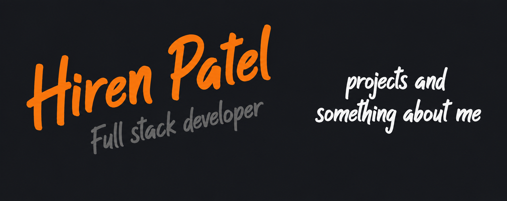

# Hello, folks! 

🔭 I’m working as a **Software Development Engineer**, building and maintaining production-grade software in a professional environment. 
💻 Professional experience in **full-stack development**, primarily working with **React and .NET Core**. 
🚀 Passionate about building scalable software, exploring new technologies, and solving real-world problems. 
🛠️ Experienced in developing, maintaining, and contributing to **production applications and enterprise software**. 
🌱 Always learning, experimenting with new technologies, and improving my engineering skills. 
✍️ In my free time, I enjoy exploring the latest design and development trends and sometime watch an anime. 
☕ I believe a good and supportive team can turn even challenging problems into solvable ones. 
🏢 Most of my professional development work and daily contributions are within **private enterprise repositories**.

## 🌐 Socials:

## 💻 Tech Stack

                             
     
    

### ✍️ Random Dev Quote

---

